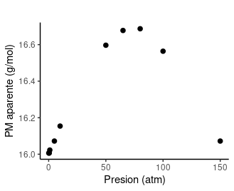
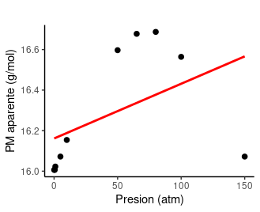

# Algunos tips y consejos informales para R

En este apartado se relevarán tips, links y consejos que pueden ser de utilidad relacionado con el entorno de trabajo R.

Consulte esta sección regularmente porque se irá extendiendo a medida que agreguemos cosas.

[Volver a la Intro](README.md)

## Regresión lineal y algo de edición de data frames

Ya estuvimos viendo lo básico sobre como importar un set de datos y hacer un análisis de regresión de los datos.

Ahora, tomando como ejemplo el **ejercicio 1.6** vamos a ver algunas cosas más que podemos hacer y que les pueden resultar útiles en el futuro.

Vamos a trabajar sólo con los datos del metano ya que son los más complicados.

Primero vamos a cargar los datos de presión y densidad correspondientes al metano, y de paso llamamos a la librería ggplot2 porque la vamos a usar más adelante.

```
library(ggplot2)

pre <- c(0.1, 0.5, 1, 5, 10, 50, 65, 80, 100, 150)
den_ch4 <- c(0.0976, 0.488, 0.977, 4.9, 9.85, 50.6, 66.1, 81.4, 101, 147)
```

Luego calculamos los pesos moleculares aparentes (esto ya lo demostramos anteriormente)

```
pm_ch4 <- 0.082*200*den_ch4/pre
```

Ahora hacemos un data frame con nuestras variables y vemos cómo quedó.

```
datos <- data.frame(pre, den_ch4, pm_ch4)
datos
```

En la consola deberíamos ver algo así :

```
> datos
     pre  den_ch4   pm_ch4
1    0.1   0.0976 16.00640
2    0.5   0.4880 16.00640
3    1.0   0.9770 16.02280
4    5.0   4.9000 16.07200
5   10.0   9.8500 16.15400
6   50.0  50.6000 16.59680
7   65.0  66.1000 16.67754
8   80.0  81.4000 16.68700
9  100.0 101.0000 16.56400
10 150.0 147.0000 16.07200
```

Graficamos los datos para ver qué tenemos:

```
plot_1 <- ggplot(datos, aes(x=pre, y=pm_ch4))+
  geom_point(colour = "black", size = 2) +
  theme_classic() +
  labs(title = "",
       x = "Presion (atm)",
       y = "PM aparente (g/mol)") 
 
 plot_1
```

El gráfico se ve así:



Por supuesto NO vamos a hacer una regresión lineal en este caso porque claramente los datos no se ajustan a una recta.



El ajuste anterior **NO** es un modelo aceptable.

Como nosotros queremos extrapolar a presión cero para poder calcular la mejor masa molar, podríamos tomar solo los primeros valores, que parecen ajustarse bien a una recta para hacer la regresión.

## Subset (filtrando data frames)

En R existe una función llamada **subset** que me permite filtrar los datos de acuerdo a algun criterio.

Probemos lo siguiente:

```
recortado <- subset(datos, pre<50)
recortado
```

Deberíamos ver algo así:

```
> recortado
   pre den_ch4  pm_ch4
1  0.1  0.0976 16.0064
2  0.5  0.4880 16.0064
3  1.0  0.9770 16.0228
4  5.0  4.9000 16.0720
5 10.0  9.8500 16.1540
```

Notar que ahora sólo nos quedamos con las filas en las que la presión es menor a 50 atm.

Esta función puede ser usada dentro del comando lm directamente:

```
fit <- lm(pm_ch4~pre, data=datos, subset=(pre<50))
resumen <- summary(fit)
```

Lo que hicimos en los comandos anteriores fue generar el modelo lineal utilizando sólo los valores en los que la presión es menor a 50 atm. Luego creamos un objeto resumen que contiene el summary de la regresión. Este objeto contiene mucha de la información del análisis de regresión.

Si queremos ver sólo la ordenada al origen y la pendiente, podemos generar una matriz de coeficientes:

```
resumen$coefficients
```

Verán algo así:

```
> resumen$coefficients
               Estimate   Std. Error    t value     Pr(>|t|)
(Intercept) 16.00294426 0.0030406026 5263.08313 1.512690e-11
pre          0.01487221 0.0006050786   24.57897 1.476378e-04
```

Si queremos podemos guardar en nuevas variables los valores de la pendiente y la ordenada al origen accediendo a la matriz anterior.

```
ordenada <- resumen$coefficients[1,1]
pendiente <- resumen$coefficients[2,1]
```

Notar que dentro de los corchetes está el elemento de matriz al cual queremos acceder [fila, columna]. Es importante mencionar que a diferencia de otros lenguajes, el primer elemento de una lista es [1] y no [0].

Podemos ver qué extrajimos

```
pendiente
ordenada
```

Y obtendremos

```
> pendiente
[1] 0.01487221
> ordenada
[1] 16.00294
```

En la clase anterior vimos cómo agregar la recta de regresión al gráfico con geom_smooth, ahora veremos otra manera que nos permitirá agregar la recta que nosotros queramos a un gráfico.

```
plot_2 <- plot_1 + geom_abline( slope= pendiente, intercept= ordenada, color= 'red')
plot_2
```

Notar que en el comando anterior **pendiente** y **ordenada** son los objetos que extrajimos de la matriz de los coeficientes.

Nota: Podemos reemplazar esas variables por los numeros que nosotros queramos para graficar cualquier otra recta.

Obtendrán el siguiente gráfico:


Volvamos por un momento a nuestra tabla recortada:

```
> recortado
   pre den_ch4  pm_ch4
1  0.1  0.0976 16.0064
2  0.5  0.4880 16.0064
3  1.0  0.9770 16.0228
4  5.0  4.9000 16.0720
5 10.0  9.8500 16.1540
```

En este caso, no es necesario hacerlo, pero podríamos querer excluir alguna fila de nuestro análisis de regresión.

En R, no podemos eliminar datos del data frame, pero podemos generar otro donde filtramos la fila a elección. Supongamos que queremos sacar la segunda fila:

```
mas_recortado <- recortado[-c(2),]
mas_recortado
```

Veremos algo así:

```
> mas_recortado
   pre den_ch4  pm_ch4
1  0.1  0.0976 16.0064
3  1.0  0.9770 16.0228
4  5.0  4.9000 16.0720
5 10.0  9.8500 16.1540
```

Fijarse que la numeración de las filas pasa de la 1 a la 3 porque excluimos la 2. Lo que está adentro de los corchetes significa que omita de la fila 2, todas las columnas.

[Aquí](scripts/1-6.R) pueden acceder al script completo con todos los comandos anteriores.

Eso es todo por ahora, a medida que vayamos seleccionando cosas útiles, las iremos agregando aquí.

Para volver a la página principal:
[Introducción a R](https://foni90mdq.github.io/trabajo-practico-r.github.io/)

